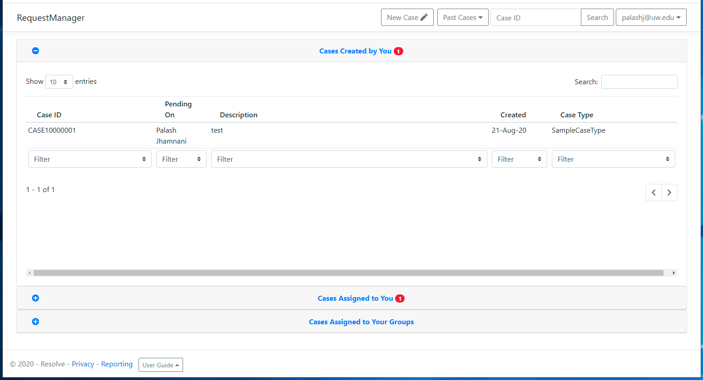
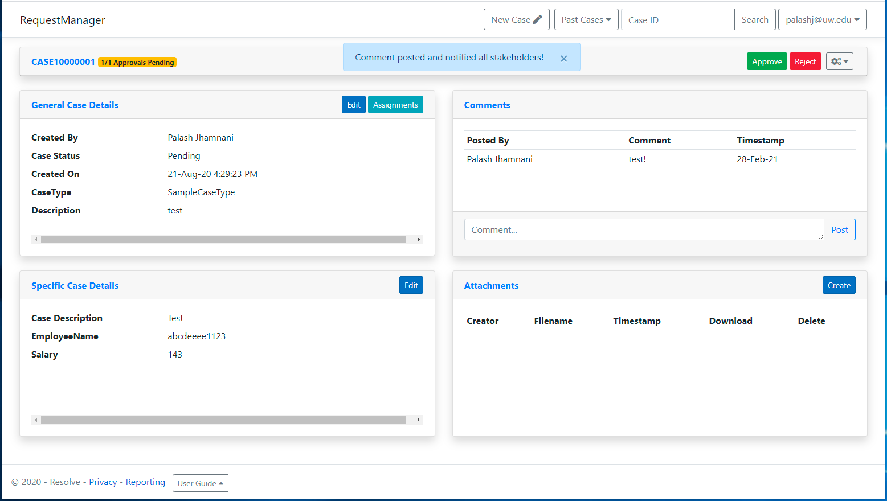
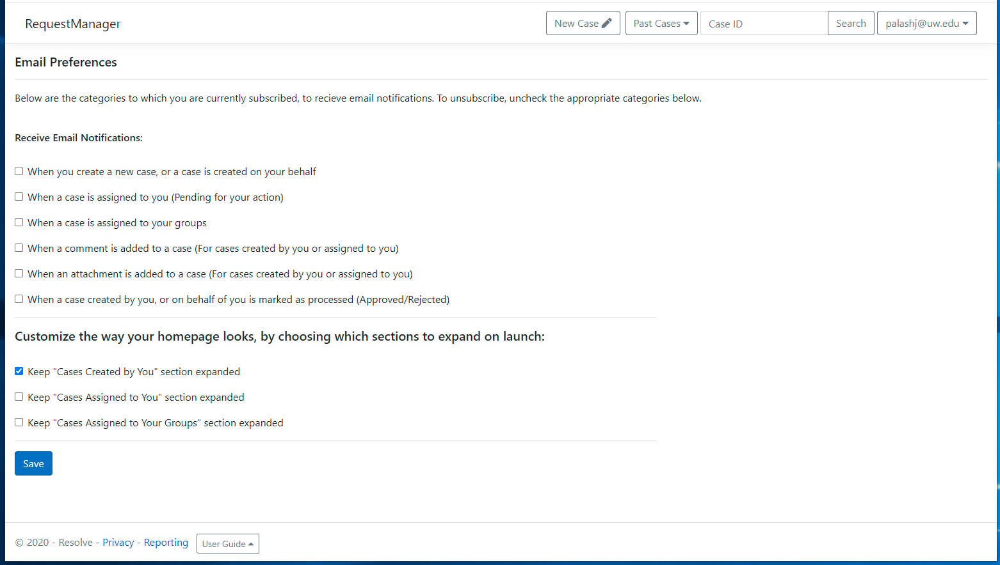
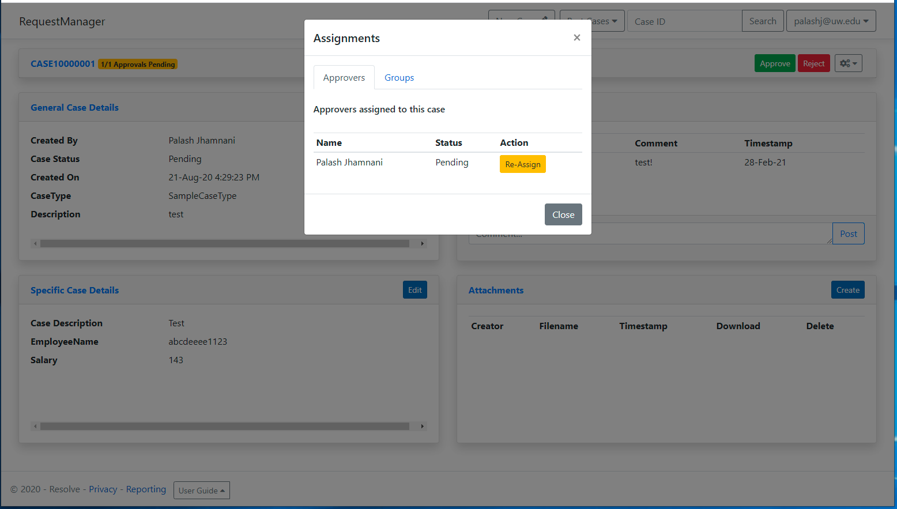
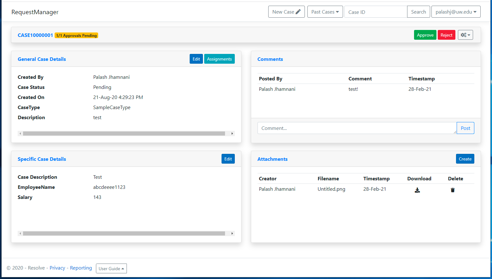

# Resolve
Resolve is a case management software developed to manage cases, which are service requests created by members of an organization, going through an approval workflow.

### Case Creation


### Updated Screens:

#### Homepage



#### Ticket View



#### Preferences



#### Assignments



#### Attachment/Attachments



Before you run the application, you would need to create an "appsettings.json" file in the parent directory of the application with the following contents:


```javascript
{
  "AzureAd": {
    "Instance": "https://login.microsoftonline.com/",
    "Domain": "",
    "TenantId": "",
    "ClientId": "",
    "CallbackPath": "/signin-oidc",
    "ClientSecret": ""
  },
  "Logging": {
    "LogLevel": {
      "Default": "Information",
      "Microsoft": "Warning",
      "Microsoft.Hosting.Lifetime": "Information"
    }
  },
  "Smtp": {
    "FromAddress": "abc@example.com",
    "Server": "smtp.example.com",
    "Password": "",
    "Port": ##
  },
  "Launch": {
    "Host_Name": "localhost or hostname",
    "Host_Port":  443/80/etc
  },
  "AllowedHosts": "*",
  "GraphApiUrl": "https://graph.microsoft.com/beta",
  "ConnectionStrings": {
    "ResolveContext": ""
  }
}
```

Fill values w.r.t your application for Domain, TenantId, ClientId, ClientSecret & ConnectionStrings for Database
